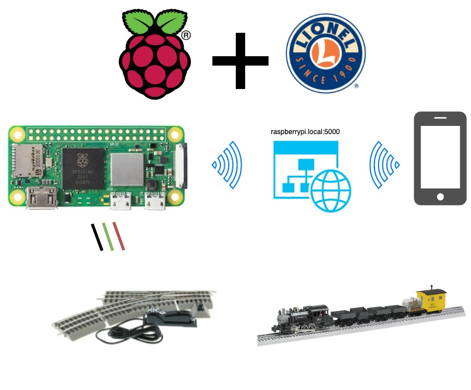

# Control Lionel Switches with a Raspberry Pi Zero 2 W and Servos!
This project demonstrates how to control Lionel Train Switches from a Raspberry Pi (RPi).



## Necessary Hardware
[Lionel Manual Switches](http://www.lionel.com/products/fastrack-o36-manual-switch-right-hand-6-12018/)
- [SG-90 Servo](https://www.amazon.com/Micro-Servos-Helicopter-Airplane-Controls/dp/B07MLR1498/ref=sr_1_1_sspa?crid=1R024DTWR7UM1&keywords=SG90+servo&qid=1641540462&sprefix=sg90+servo%2Caps%2C124&sr=8-1-spons&psc=1&spLa=ZW5jcnlwdGVkUXVhbGlmaWVyPUFaUjlQT1Q5UEgzQjAmZW5jcnlwdGVkSWQ9QTA3NzcxNTBMRlhKM1pNTzVYWkgmZW5jcnlwdGVkQWRJZD1BMDY1ODY0NjJVQVo1UVpWWjNQOVQmd2lkZ2V0TmFtZT1zcF9hdGYmYWN0aW9uPWNsaWNrUmVkaXJlY3QmZG9Ob3RMb2dDbGljaz10cnVl)
- [Female to female Jumper Cables
](https://www.amazon.com/EDGELEC-Breadboard-Optional-Assorted-Multicolored/dp/B07GD2BWPY/ref=sr_1_2_sspa?keywords=edgelec+120pcs+breadboard+jumper+wires&qid=1641540430&sprefix=EDGELEC+%2Caps%2C128&sr=8-2-spons&psc=1&spLa=ZW5jcnlwdGVkUXVhbGlmaWVyPUEzQUlVRkxCOTRZTzROJmVuY3J5cHRlZElkPUEwNTcxMzM4M0czSzhEQ1QyV0FSWCZlbmNyeXB0ZWRBZElkPUEwNDMxMzE5MlUwTkxJNUdHODJCVSZ3aWRnZXROYW1lPXNwX2F0ZiZhY3Rpb249Y2xpY2tSZWRpcmVjdCZkb05vdExvZ0NsaWNrPXRydWU=)

[Lionel Remote Switches](http://www.lionel.com/products/fastrack-o36-remote-switch-right-hand-6-12046/)
- [5V 2-Channel Relay Interface](https://www.amazon.com/SainSmart-101-70-100-2-Channel-Relay-Module/dp/B0057OC6D8/ref=sr_1_1?keywords=sainsmart+2-channel&qid=1641540392&sr=8-1)
- [Male to Female Jumper Cables](https://www.amazon.com/EDGELEC-Breadboard-Optional-Assorted-Multicolored/dp/B07GD2BWPY/ref=sr_1_2_sspa?keywords=edgelec+120pcs+breadboard+jumper+wires&qid=1641540430&sprefix=EDGELEC+%2Caps%2C128&sr=8-2-spons&psc=1&spLa=ZW5jcnlwdGVkUXVhbGlmaWVyPUEzQUlVRkxCOTRZTzROJmVuY3J5cHRlZElkPUEwNTcxMzM4M0czSzhEQ1QyV0FSWCZlbmNyeXB0ZWRBZElkPUEwNDMxMzE5MlUwTkxJNUdHODJCVSZ3aWRnZXROYW1lPXNwX2F0ZiZhY3Rpb249Y2xpY2tSZWRpcmVjdCZkb05vdExvZ0NsaWNrPXRydWU=)
- [22 Gauge Solid Wire Hookup Wires](https://www.amazon.com/Gauge-Wire-Solid-Hookup-Wires/dp/B088KQFHV7/ref=sr_1_2?crid=3RJFP5R14PQE&keywords=22+gauge+solid+wire+hookup+wire&qid=1641540503&sprefix=sg90+servo%2Caps%2C127&sr=8-2)


## Hardware Setup
**Lionel Manual Switches**
- [Connecting SG-90 Servo to RPi](https://www.youtube.com/watch?v=xHDT4CwjUQE)
- TODO: setup for building clay structures

**Lionel Remote Switches**
- [Connecting remote switch to the control relay remote switch](https://www.dexterindustries.com/Arduberry/example-projects-with-arduberry-and-raspberry-pi/lionel-train-switch-control-with-a-raspberry-pi-2/)
- [Connecting RPi to control relay](https://www.electronicshub.org/control-a-relay-using-raspberry-pi/)

## Installation
```bash
cd ~
git clone https://github.com/jakee417/Pi-Train-Switching.git
cd Pi-Train-Switching
nano train_switch.service
# Find "EDIT USER HERE" and add your username
```
## Services
Since our project relies upon the `pigpiod` pin factory, start this [daemon](https://en.wikipedia.org/wiki/Daemon_(computing)):
```bash
sudo systemctl enable pigpiod
```
Now start the train service, `train_switch.service`
```bash
cd /home/user/Pi-Train-Switching
sudo cp train_switch.service /etc/systemd/system/train_switch.service
sudo systemctl enable train_switch.service
```
Verify the service is running with,
```bash
sudo systemctl status train_switch.service
```
You should see,
```
● train_switch.service - Train Switch
     Loaded: loaded (/etc/systemd/system/train_switch.service; enabled; vendor preset: enabled)
     Active: active (running) since Thu 2022-01-06 21:20:10 HST; 1h 2min ago
   Main PID: 9313 (python3)
      Tasks: 5 (limit: 409)
        CPU: 2.438s
     CGroup: /system.slice/train_switch.service
             └─9313 /usr/bin/python3 app.py

Jan 06 21:20:10 raspberrypi systemd[1]: Started Train Switch.
Jan 06 21:20:11 raspberrypi python3[9313]:  * Serving Flask app "app" (lazy loading)
Jan 06 21:20:11 raspberrypi python3[9313]:  * Environment: production
Jan 06 21:20:11 raspberrypi python3[9313]:    WARNING: This is a development server. Do not use it in a production deployment.
Jan 06 21:20:11 raspberrypi python3[9313]:    Use a production WSGI server instead.
Jan 06 21:20:11 raspberrypi python3[9313]:  * Debug mode: off
```

## Viewing the Web Server
- First, ensure the RPi and client machine (laptop, cellphone tablet, etc.) are on the same LAN network. 
- On your client machine  browse to [`http://raspberrypi.local:5000`](http://raspberrypi.local:5000). If you have a custom `hostname`, replace it for `raspberrypi`.
- Alternatively, on the RPi you can run
```bash
ifconfig
```
and record your `ip address`. Browing to this `ip address` on `port 5000` will also allow you to view the web server.